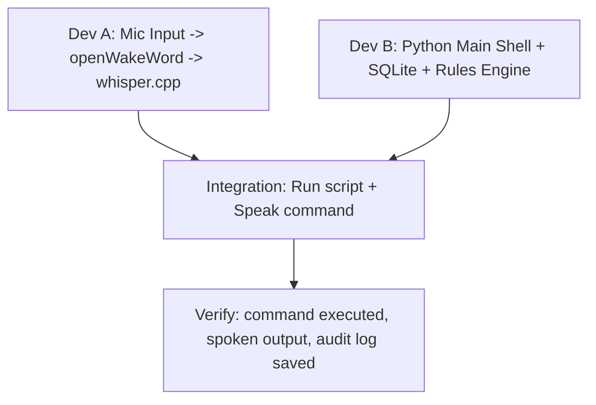

# Mynah — Collaborative Build Plan for 2 Developers

This document adapts the original 9-week single-developer plan into a parallelized roadmap for a **two-person team**. 

By dividing responsibilities into distinct subsystems, we minimize merge conflicts, keep the project moving forward at double the speed, and ensure that **the system is integrated and runnable at the end of every week**.

---

## 👥 The Team Roles

To make parallel execution seamless, the work is split by subsystem ownership:

| Developer | Core Domain | Key Subsystems | Focus |
|---|---|---|---|
| **Dev A** (Systems & Audio) | **The Body** | Audio capture, wake word, whisper.cpp, TTS output, UI (menu bar), macOS system tools, SQLite metrics. | Latency, device integration, OS permissions, performance. |
| **Dev B** (Logic & Memory) | **The Brain** | Application shell, tool registry, routing tier, local/cloud LLM clients, Markdown vault operations, safety gates. | Logic correctness, structured generation, RAG, prompt tuning. |

---

## 🔌 Core Interface Agreements (Agree on these in Week 1)

To prevent blockers, you must agree on these simple interfaces during your first sync:

### 1. The Tool Schema & Registry
```python
# tools/base.py
from typing import Callable, Any, Dict

class ToolRegistry:
    def __init__(self):
        self.registry: Dict[str, Dict[str, Any]] = {}

    def register(self, name: str, description: str, classification: str, func: Callable):
        """
        classification: 'safe' or 'irreversible'
        """
        self.registry[name] = {
            "description": description,
            "classification": classification,
            "func": func
        }

    def execute(self, name: str, args: dict) -> Any:
        return self.registry[name]["func"](**args)
```

### 2. The Audio-to-Router Handshake
When Dev A's audio loop transcribes speech, it hands the text off to Dev B's router:
```python
# router/core.py
def route_and_execute(text: str, context: dict) -> dict:
    """
    Called by the audio loop.
    Returns a dict containing:
      {
        "text": text,
        "matched_tier": 0 | 1 | 2,
        "tool_executed": str,
        "args": dict,
        "result": str,
        "spoken_reply": str
      }
    """
    pass
```

### 3. The SQLite Audit Schema
```sql
CREATE TABLE turns (
  id INTEGER PRIMARY KEY AUTOINCREMENT,
  ts TIMESTAMP DEFAULT CURRENT_TIMESTAMP,
  transcript TEXT,
  frontmost_app TEXT,
  path TEXT,
  confidence REAL,
  tool TEXT,
  args TEXT, -- JSON string
  result TEXT,
  tokens_in INTEGER DEFAULT 0,
  tokens_out INTEGER DEFAULT 0,
  cost_usd REAL DEFAULT 0.0,
  latency_stt REAL,
  latency_route REAL,
  latency_exec REAL,
  confirmed BOOLEAN,
  repeated BOOLEAN DEFAULT 0
);
```

---

## 📅 The Week-by-Week Plan

### Week 0 — Look before you build
*Recommended Total Time: 3 hours per person*

| Task | Dev A | Dev B |
|---|---|---|
| **Research & Competitive Analysis** | Install and use [Jarvis](https://jarvis.ceo) on your Mac for an hour. Focus on its latency (how it feels) and audio trigger sensitivity. | Install and use [Dottie](https://github.com/) (or read its docs) to explore how system-native tools are exposed. |
| **Writeup** | Write a brief description of what Jarvis does well (e.g., latency, audio feedback) and what's missing. | Write a brief description of the system tool API designs they use. |
| **Sync** | **Alignment Sync:** Meet for 1 hour. Compare findings, walk through the repository layout, and finalize your Git branching rules. |

---

### v0.1 — The Voice Launcher (Week 1)
*Goal: Speak to your Mac and have it execute basic commands in under 1.0 second.*



#### Weekly Tasks (4.5 hours per person)
* **Dev A Tasks (Systems):**
  1. Set up PyObjC audio capture ring buffer to handle microphone inputs.
  2. Integrate `openWakeWord` with a custom phrase and tune sensitivity.
  3. Wire in `whisper.cpp` (`small.en`) to transcribe the buffered audio stream immediately on wake.
  4. Write a simple wrapper around the macOS native `say` command for TTS output.
* **Dev B Tasks (Brain):**
  1. Build the base repository directory structure and write the SQLite audit schema setup code.
  2. Implement the core Python application loop and the `ToolRegistry`.
  3. Create the Tier 0 rule-based Router (reads patterns from YAML and does regex matching).
  4. Write the execution wrappers for the first 10 basic commands (apps, volume, snaps).

#### Integration & Verification (Weekend Sync - 2 hours)
* Merge both branches. 
* **Verification:** Run `run.py`. Say *"Mynah, open Slack"*.
  * *Verification steps:* Does it wake up? Does it transcribe correctly? Does Terminal launch within 1 second? Check the SQLite file to confirm a row is added to the `turns` table.

---

### v0.2 — Memory (Week 2)
*Goal: The system can save notes by voice and search through them.*

#### Weekly Tasks (4.5 hours per person)
* **Dev A Tasks (Systems):**
  1. Write the Python tool integration for `ripgrep` search on the local filesystem.
  2. Create the ranking module: pull grep search results and sort them by file recency first.
  3. Build helper scripts for window control and frontmost application state reporting (`osascript`).
* **Dev B Tasks (Brain):**
  1. Set up the local Vault directory structure: `me/`, `facts/`, `daily/`, and `quarantine/`.
  2. Create the `vault.append` tool: automatically write formatted markdown files to the daily log with date and timestamps.
  3. Implement the **Quarantine boundary rules** (content captured from external tools is quarantined and flagged so it never leaks into the core system prompts).
  4. Write the speech synthesis formatting logic to output clean responses with source references (e.g. *"From your note on Tuesday..."*).

#### Integration & Verification (Weekend Sync - 2 hours)
* **Verification:** Run Mynah. Speak: *"Remember that my library card number is 9876"*. Wait 10 seconds. Speak: *"What is my library card number?"*.
  * *Verification steps:* Confirm the card number is read out loud. Open your local Markdown vault directory and verify the quarantine headers are properly formatted.

---

### v0.3 — Local Brain (Weeks 3-4)
*Goal: Replace rigid regex commands with a local LLM routing to tools.*

#### Week 3 Tasks (4.5 hours per person)
* **Dev A Tasks (Systems):**
  1. Install Ollama and pull `qwen2.5:1.5b-instruct-q4_K_M`. Benchmark its token-generation speed (tokens/sec) and monitor system RAM footprint on battery vs. wall power.
  2. Set up the local model tool-calling prompt infrastructure.
* **Dev B Tasks (Brain):**
  1. Write structured JSON schemas for every registered tool.
  2. Implement constrained decoding (guaranteeing valid tool JSON payloads using GBNF grammar templates or Ollama's tool API).
  3. Implement the fallback logic: if the local LLM routing confidence is low, escalate to a manual query or safety mode.

#### Week 4 Tasks (4.5 hours per person)
* **Dev A Tasks (Systems):**
  1. **Spike: Apple Foundation Models (Swift Bridge).** Build a tiny Swift CLI helper that routes commands using the system-native model framework. Benchmark performance and accuracy.
  2. Compare RAM overhead: does the Swift framework save the 1.1GB RAM footprint of Qwen? Document the final decision.
* **Dev B Tasks (Brain):**
  1. Set up context injectors: pull the active workspace status, active app window title, identity blocks (`me/`), and the last 2 conversation turns.
  2. Implement lazy-loading: load the local LLM only when Tier 0 fails, and unload after 5 minutes of inactivity to reclaim system memory.

#### Integration & Verification (Weekend Sync)
* **Verification:** Run a test script with 50 varying command formulations (e.g. *"Can you close this window?"*, *"Snap it left"*, *"Write down that I need groceries"*).
  * *Verification steps:* Confirm routing accuracy is above 90% and that the model returns correct JSON arguments.

---

### v0.4 — Escalation and Guardrails (Week 5)
*Goal: Escalate complex queries to ChatGPT safely while keeping costs strictly controlled.*

#### Weekly Tasks (4.5 hours per person)
* **Dev A Tasks (Systems):**
  1. Build token counting utility modules (using `tiktoken` or equivalent).
  2. Write middleware that intercepts outgoing router calls to check the daily spend limit.
  3. Integrate performance measurement: track latencies of the STT, Router, and Execution steps, and save them in the SQLite `turns` table.
* **Dev B Tasks (Brain):**
  1. Integrate the OpenAI ChatGPT API client (using `gpt-4o-mini`). Implement structured output formatting to minimize cost.
  2. Write the routing rules: trigger gpt-4o-mini (Tier 2) only on explicit knowledge queries or if the local model returns low confidence.
  3. Build the token limit checker: reject and speak a refusal warning if an input payload exceeds 8,000 tokens.

#### Integration & Verification (Weekend Sync - 2 hours)
* **Verification:** Speak: *"Who is the current prime minister of the UK?"*. 
  * *Verification steps:* Verify it escalates to gpt-4o-mini. Open the SQLite database and confirm the transaction cost is logged.
* **Ceiling Test:** Set the daily cost limit to `$0.01` in your configuration. Speak: *"Compare Python and Go"*. Confirm the system refuses to run the query and speaks the refusal warning.

---

### v0.5 — Capture & Context (Weeks 6-7)
*Goal: Add meeting transcription, daily compaction, and clipboard action tools.*

#### Week 6 Tasks (Continuous Input & Compaction)
* **Dev A Tasks (Systems):**
  1. Build a continuous recording utility that uses voice activation detection (VAD) to record conversations.
  2. Implement a basic speaker segmentation function (identifying speaker switches by timing or acoustic shifts).
* **Dev B Tasks (Brain):**
  1. Write the meeting parser: clean up raw transcripts, extract action items/decisions, and append them to the Vault.
  2. Write the daily compaction script (run via a nightly cron or `launchd` service) that uses an LLM to summarize daily logs and promote important facts into permanent files.

#### Week 7 Tasks (Clipboard & Synthesis)
* **Dev A Tasks (Systems):**
  1. Implement a clipboard inspection tool (reads text from the active OS selection).
  2. Build system hooks for global shortcut integrations.
* **Dev B Tasks (Brain):**
  1. Build clipboard tools: `"Explain this code"`, `"Summarize this text"`, `"Translate this selection"`.
  2. Create memory review tools: *"Quiz me on my notes"* or *"Summarize what I learned this month"*.

#### Integration & Verification (Weekend Sync)
* **Verification:** Select a block of code, press the voice key, and say: *"Explain this"*. 
  * *Verification steps:* Confirm it reads the clipboard, routes it correctly, and speaks the summary. Verify that the daily compaction script runs automatically and summarizes the day's events.

---

### v1.0 — Safety & Polish (Weeks 8-9)
*Goal: Implement system-level safety controls and optimize audio loop responsiveness.*

#### Week 8 Tasks (Safety & Controls)
* **Dev A Tasks (Systems):**
  1. Build the macOS Menu Bar helper app (using `rumps` or PyObjC) to display current mute status, today's spend, and provide a quick toggle settings view.
  2. Implement the system-wide **Global Kill Switch** hotkey (instantly kills model subprocesses and halts speech output).
* **Dev B Tasks (Brain):**
  1. Implement safety classification for tools: label every tool schema as either `safe` or `irreversible`.
  2. Build the **Spoken Confirmation Gate**: if an irreversible tool is triggered, speak the intent, wait for a verbal *"yes"*, and automatically time out to a refusal if no confirmation is received.

#### Week 9 Tasks (Audio Polish & Latency)
* **Dev A Tasks (Systems):**
  1. Implement streaming speech-to-text (STT) processing in 500ms sliding windows.
  2. Set up the audio echo cancellation using Voice Processing AudioUnit (allowing the user to speak over the assistant's voice).
  3. Integrate power-aware rules: automatically unload local LLM weights when the Macbook is on battery.
* **Dev B Tasks (Brain):**
  1. Implement **Sentence-Boundary streaming TTS**: split the incoming LLM token stream by punctuation, feeding finished sentences to the TTS speech queue immediately instead of waiting for the full response to generate.
  2. Perform final end-to-end latency optimizations.

#### Integration & Verification (The Release)
* Run Mynah for 7 days without restarting.
* **Verification:** Try to delete a file or send a message. Verify that the confirmation gate asks: *"Are you sure?"* and halts if you say nothing. Press the kill switch while the assistant is speaking and confirm it stops immediately.

---

## 🏆 Collaborative Best Practices

1. **Branching Model:** 
   - Work on separate git branches (e.g., `dev-a/audio-pipeline` and `dev-b/vault-core`).
   - Merge to `main` only on weekends after running the Integration & Verification steps.
2. **Weekly Sync (60-90 minutes):**
   - **Show & Tell (15m):** Demo what you built during the week.
   - **Merge & Fix (45m):** Merge branches on one machine, fix any integration bugs.
   - **Next Week Prep (20m):** Discuss interface updates or blockages.
3. **No Placeholders:**
   - Write clean, functional mock functions if your partner's code is not ready yet. Never commit print statements as a substitute for real functionality.
